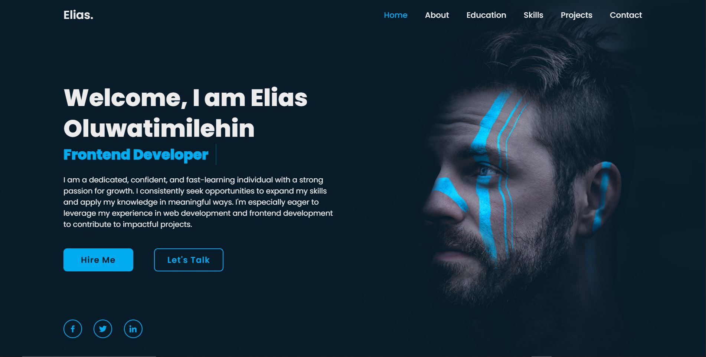

# DevElias Portfolio Website

This is a personal portfolio website created by **Elias Oluwatimileyin** to showcase his frontend development skills, educational background, and projects.

---

## 🚀 Project Overview

The website is designed as a responsive, animated portfolio with smooth navigation and scroll-based effects. It includes various sections like **Home**, **About**, **Education**, **Skills**, **Projects**, and **Contact**.

---

## ✨ Features Implemented

- Responsive navigation menu with toggle button (hamburger icon)
- Scroll-triggered animations using CSS and JavaScript
- Dynamic navigation link highlighting based on section scroll position
- Interactive project cards with hover effects
- Animated text using custom keyframes
- Contact form with styled inputs
- Smooth scrolling behavior across the entire site

---

## 🛠 Technologies Used

- **HTML5**
- **CSS3**
- **JavaScript (Vanilla JS)**
- **Boxicons**
- **Google Fonts**
- **Vercel**

---

## 🔧 Setup Instructions

1. Clone this repository or download the ZIP folder.
2. Open the folder in a code editor (like VS Code).
3. Open `index.html` in your browser or live server.
4. To customize:
   - Edit content in `index.html`
   - Modify styles in `styles.css`
   - Update animations and interactivity in `script.js`

---

## ⚠️ Challenges Faced and Solutions

- **Responsiveness**:  
  At first, the site was not displaying well on smaller screens.  
  ✅ **Solution**: Watched more tutorials and applied media queries and responsive CSS.

- **Animations and scroll effects**:  
  Implementing smooth scroll-triggered animations was difficult.  
  ✅ **Solution**: Studied JavaScript tutorials and practiced using custom animations with the `IntersectionObserver` and scroll events.

---

## 🖼️ Screenshots

_Add screenshots here:_  
- 
- 

---

## 📂 Project Folder Structure

```
├── index.html
├── styles.css
├── script.js
└── images/
```

---

## 🌐 Live Demo

You can view the live site here: [https://elias-dev-eight.vercel.app/](https://elias-dev-eight.vercel.app/)

---


### 📌 Designed and maintained by Elias Oluwatimileyin © 2025
